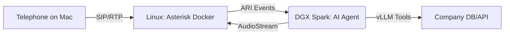

# 🎙️ On-Premise Multimodal AI Telephony

A high-performance, private AI voice agent bridging **Asterisk IP Telephony** with **NVIDIA DGX Spark** inference. This system enables real-time, low-latency conversational AI with full tool-calling capabilities, running entirely on your local hardware.

## 🏗️ System Architecture

The project implements a "Split-Plane" architecture across machines:

* **Control Plane (Linux + Docker):** A Linux host runs Asterisk in Docker (`docker-compose.yaml` in this repo)—SIP signaling, RTP, and the ARI (Asterisk REST Interface) gateway. **Do not run the agent on the Asterisk host** unless you are only testing; production STT/LLM/TTS belongs on the DGX.
* **Client:** **Telephone** (or another SIP app) on **macOS** registers to the Linux Asterisk box over the LAN.
* **Data Plane (DGX Spark):** Runs the AI voice agent—Whisper, vLLM, Piper—orchestrated by Pipecat. **The agent is intended to run on the DGX Spark**, leveraging the Grace Blackwell architecture for ultra-fast TTFT (Time to First Token).



---

## 📁 Project Structure

```text
telephony/
├── docker-compose.yaml      # Asterisk PBX stack (run on Linux host)
├── config/                  # Asterisk configs (bind-mounted into the container)
│   ├── ari.conf             # ARI Auth & App definitions
│   ├── extensions.conf      # Dialplan for Stasis(ai-assistant)
│   ├── http.conf            # ARI Port 8088 bindings
│   ├── modules.conf         # Loadable Asterisk plugins
│   └── websocket_client.conf # External Media → DGX (set uri to DGX IP)
└── agent/                   # AI Orchestrator — run on DGX Spark
    ├── pyproject.toml       # Managed by uv
    ├── uv.lock              # Deterministic dependencies
    ├── .env.example         # Template (copy to .env on DGX Spark)
    ├── .env                 # Secrets — set ASTERISK_IP to the Asterisk host IP
    └── src/
        └── voice_agent/     # Namespaced source package
            ├── main.py      # Entrypoint & runner
            ├── pipeline.py  # Pipecat flow orchestration
            ├── services/    # STT/LLM/TTS Factory (Blackwell optimized)
            └── tools/       # Function handlers (e.g. Order Lookup)
```

---

## 🚀 Quick Start

### 1. Gateway Setup (Linux — Docker)

On the **Linux machine** that will host Asterisk:

1. Ensure `config/` contains the required `.conf` files (especially `websocket_client.conf` pointing at your DGX).
2. From the repo root: `docker compose up -d`

*Verify on the Linux host:* `curl -v -u ai_user:your_password http://localhost:8088/ari/asterisk/info`

### 2. Inference Engine Setup (DGX Spark only)

**Run these commands on the DGX Spark machine—not on the Linux Asterisk host.** The agent should run on DGX Spark for GPU-accelerated STT/LLM/TTS.

Copy `agent/.env.example` to `agent/.env` and set `ASTERISK_IP` to your **Linux Asterisk host’s IP** (reachable from the DGX).

**Option A — Docker Compose (recommended)**  
Starts vLLM + agent in one go:

```bash
cd agent
docker compose up -d
```

The agent waits for vLLM to be healthy before starting. On the **Asterisk host**, ensure `config/websocket_client.conf` uses `uri = ws://YOUR_DGX_IP:8787/media` (or equivalent), then restart Asterisk if you changed it.

**Option B — Manual**  
Start vLLM separately, then the agent:

```bash
# Terminal 1: vLLM (or use your own vLLM startup)
vllm serve Qwen/Qwen2.5-7B-Instruct --host 0.0.0.0 --port 8000

# Terminal 2: Agent
cd agent
uv sync
uv run main.py
```

**Asterisk 22 requirement:** The agent connects *inbound* to Asterisk and registers the `ai-assistant` app. You **must** start the agent **before** placing any call. If a call arrives before the agent is connected, Asterisk will fail with `Failed to find outbound websocket per-call config`.

You should see: `Connecting to ARI at ...` and `Starting Media server on 0.0.0.0:8787`.

Environment variables in `agent/.env` (on the DGX Spark):

| Variable | Default | Description |
|----------|---------|-------------|
| `ASTERISK_IP` | `192.168.1.23` | IP of the Linux host running Asterisk (agent connects to this) |
| `ARI_USER` / `ARI_PASS` | — | ARI credentials (match `config/ari.conf` on the Asterisk host) |
| `VLLM_BASE_URL` | `http://localhost:8000/v1` | vLLM API (overridden to `http://vllm:8000/v1` in docker-compose) |
| `LLM_MODEL` | `Qwen2.5-7B-Instruct` | Model name (must match vLLM `--served-model-name`) |
| `WHISPER_DEVICE` | `cuda` | `cuda` for DGX, `cpu` only for non-GPU testing |
| `PIPER_USE_CUDA` | `true` | GPU acceleration for TTS on DGX |
| `PIPER_VOICE` | `en_US-ryan-high` | Piper TTS voice |
| `ARI_MEDIA_CONNECTION` | `media_connection1` | Websocket client section name in Asterisk's websocket_client.conf |
| `ARI_MEDIA_PORT` | `8787` | Media WebSocket port on DGX |

**Asterisk connects via websocket_client.conf:** The agent passes `external_host=media_connection1`. Edit `config/websocket_client.conf` on the **Asterisk host** and set `uri = ws://YOUR_DGX_IP:8787/media`, then restart Asterisk.

### 3. Place a Call

**Order matters:** 1) Start Asterisk on the Linux host, 2) Start the agent on the DGX (wait for `Connecting to ARI`), 3) Place the call.

Using **Telephone** on your **Mac** (or Linphone, Zoiper, etc.):

| Setting   | Value                         |
|-----------|-------------------------------|
| Server    | IP of the **Linux Asterisk host** (e.g. `192.168.1.23`) |
| Port      | 5060                          |
| Username  | 6001                          |
| Password  | password123                   |

Register, then dial extension **600** to reach the AI assistant.

**Debug (on the Linux Asterisk host):** `docker exec -it pbx-gateway asterisk -rx "ari show websocket sessions"` — you should see an inbound connection for `ai-assistant` when the agent is running. Also: `ari show apps` lists registered apps.

### CDR CSV “Permission denied” on `Master.csv`

The compose file mounts `./logs/asterisk/cdr-csv` for CSV call detail records. The Asterisk process in the image often cannot write there (host directory ownership). **`cdr_csv` is disabled in `config/modules.conf`** so logs stay clean. To enable CSV CDR instead: remove `noload => cdr_csv.so`, create `logs/asterisk/cdr-csv` on the host, then `docker exec pbx-gateway id asterisk` (or check the image docs) and `sudo chown` that folder to the same UID/GID.

### Asterisk logging

- **RTP packet dumps** (very verbose): `rtp set debug on` — turn off with `rtp set debug off` when done.
- **Reduce verbosity:** `core set debug 0` (or a lower number like 3) to limit general debug output.
- **Category-based** (Asterisk 16.15+): `core set debug category off rtp` to disable RTP debug without affecting other categories.

### "Stasis app 'ai-assistant' doesn't exist" / "Failed to find outbound websocket per-call config"

The agent must be **running and connected to ARI** before you place a call. Asterisk only routes Stasis channels to an app once an ARI client has subscribed.

1. **Start the agent on the DGX** and wait for `Connecting to ARI at ...` in its logs.
2. **Check connectivity** — from the **Linux Asterisk host**: `docker exec -it pbx-gateway asterisk -rx "ari show websocket sessions"` or `ari show apps`. You should see `ai-assistant` when the agent is connected. If not, the agent isn't reaching Asterisk.
3. **Verify `ASTERISK_IP`** in `agent/.env` — must be the Asterisk host's IP as reachable from the DGX (e.g. `192.168.1.23`). Port **8088** must be open on the Asterisk host.
4. **Place the call only after** the agent shows it is connected.

### No audio on phone

- Ensure **vLLM is running** on the DGX: `curl http://localhost:8000/v1/models`
- If vLLM is not running, the LLM step fails silently and no TTS is produced. Start vLLM first, or set `OPENAI_API_KEY` and `VLLM_BASE_URL` to use OpenAI instead.
- Check agent logs for **"Media WebSocket connected"** and **"Creating bridge"**. If you see neither, Asterisk isn't reaching the agent's media server. Verify `websocket_client.conf` `uri` points at the DGX (`ws://DGX_IP:8787/media`).
- **Echo test to isolate:** See [docs/echo-test.md](docs/echo-test.md) for step-by-step instructions. Run `mow_echo_test_server.py` on the DGX, point `websocket_client.conf` to it, and dial 601. If you hear the test clip, Asterisk↔WebSocket works and the issue is in our agent.

---

## 🛠️ Advanced Features

### ⚡ Blackwell Optimization

The agent is configured to use **NVFP4** quantization via vLLM, reducing memory footprint on the DGX Spark while maintaining intelligence, resulting in a ~35% performance boost over FP8.

### User turns, echo control, and barge-in

The pipeline uses **Silero VAD** plus **Whisper** for segmented transcription. To keep **phone echo** (the bot’s own audio picked up on the caller’s mic) from firing false “user speaking” events, inbound audio is **muted upstream while the bot is speaking** (`STTMuteFilter` + bot speaking frames from the ARI output path). That prioritizes clean playback over **true barge-in** during TTS; adjusting that tradeoff would require different echo handling (e.g. client-side AEC) or strategy changes.

### 🔧 Extensible Tools

Add new business logic to `src/voice_agent/tools/handlers.py`. The AI can:

* Check order statuses via local DB.
* Transfer calls to human queues via ARI bridges.
* Record and summarize calls locally.

---

## 🔒 Security & Privacy

* **No Cloud Egress:** All audio processing (Whisper), reasoning (vLLM), and synthesis (Piper) happen on the DGX Spark.
* **SIP Security:** Configure TLS/SRTP in the `config/` directory for encrypted telephony.

---

## 📜 License

Proprietary. Internal Use Only.
