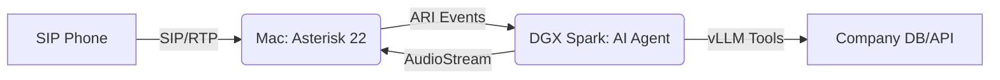

# 🎙️ Sentinel-Voice: On-Premise Multimodal AI Telephony

A high-performance, private AI voice agent bridging **Asterisk IP Telephony** with **NVIDIA DGX Spark** inference. This system enables real-time, low-latency conversational AI with full tool-calling capabilities, running entirely on your local hardware.

## 🏗️ System Architecture

The project implements a "Split-Plane" architecture across two machines:

* **Control Plane (Mac):** Handles SIP signaling, RTP media streams, and the ARI (Asterisk REST Interface) gateway via Docker. **Do not run the agent on the Mac.**
* **Data Plane (DGX Spark):** Runs the AI voice agent—Whisper, vLLM, Piper—orchestrated by Pipecat. **The agent must run on the DGX Spark only**, leveraging the Grace Blackwell architecture for ultra-fast TTFT (Time to First Token).



---

## 📁 Project Structure

```text
telephony/
├── docker-compose.yaml      # Asterisk PBX Stack (Mac)
├── config/                  # Asterisk Configurations (Mounted to Mac)
│   ├── ari.conf             # ARI Auth & App definitions
│   ├── extensions.conf      # Dialplan for Stasis(ai-assistant)
│   ├── http.conf            # ARI Port 8088 bindings
│   ├── modules.conf         # Loadable Asterisk plugins
│   └── websocket_client.conf # External Media → DGX (replace DGX_IP)
└── agent/                   # AI Orchestrator — run on DGX Spark only
    ├── pyproject.toml       # Managed by uv
    ├── uv.lock              # Deterministic dependencies
    ├── .env.example         # Template (copy to .env on DGX Spark)
    ├── .env                 # Secrets — set MAC_IP to Mac's address
    └── src/
        └── voice_agent/     # Namespaced source package
            ├── main.py      # Entrypoint & runner
            ├── pipeline.py  # Pipecat flow orchestration
            ├── services/    # STT/LLM/TTS Factory (Blackwell optimized)
            └── tools/       # Function handlers (e.g. Order Lookup)
```

---

## 🚀 Quick Start

### 1. Gateway Setup (Mac)
Ensure your `config/` folder contains the required `.conf` files, then launch the gateway:
```bash
docker compose up -d
```
*Verify with:* `curl -v -u ai_user:your_password http://localhost:8088/ari/asterisk/info`

### 2. Inference Engine Setup (DGX Spark only)
**Run these commands on the DGX Spark machine—not on the Mac.** The agent must run on DGX Spark for GPU-accelerated STT/LLM/TTS.

Copy `agent/.env.example` to `agent/.env` and set `MAC_IP` to your Mac's IP.

**Option A — Docker Compose (recommended)**  
Starts vLLM + agent in one go:

```bash
cd agent
docker compose up -d
```

The agent waits for vLLM to be healthy before starting. Ensure `config/websocket_client.conf` (on the Mac) points to the DGX's IP and port 8787.

**Option B — Manual**  
Start vLLM separately, then the agent:

```bash
# Terminal 1: vLLM (or use your own vLLM startup)
vllm serve Qwen/Qwen2.5-7B-Instruct --host 0.0.0.0 --port 8000

# Terminal 2: Agent
cd agent
uv sync
uv run main.py
```

**Asterisk 22 requirement:** The agent connects *inbound* to Asterisk and registers the `ai-assistant` app. You **must** start the agent **before** placing any call. If a call arrives before the agent is connected, Asterisk will fail with `Failed to find outbound websocket per-call config`.

You should see: `Connecting to ARI at ...` and `Starting Media server on 0.0.0.0:8787`.

Environment variables in `agent/.env` (on the DGX Spark):
| Variable | Default | Description |
|----------|---------|-------------|
| `MAC_IP` | `192.168.1.23` | IP of the Mac running Asterisk (agent connects to this) |
| `ARI_USER` / `ARI_PASS` | — | ARI credentials for the Mac gateway |
| `VLLM_BASE_URL` | `http://localhost:8000/v1` | vLLM API (overridden to `http://vllm:8000/v1` in docker-compose) |
| `LLM_MODEL` | `Qwen2.5-7B-Instruct` | Model name (must match vLLM `--served-model-name`) |
| `WHISPER_DEVICE` | `cuda` | `cuda` for DGX, `cpu` only for non-GPU testing |
| `PIPER_USE_CUDA` | `true` | GPU acceleration for TTS on DGX |
| `PIPER_VOICE` | `en_US-ryan-high` | Piper TTS voice |
| `SPARK_IP` / `DGX_IP` | — | Spark IP so Asterisk sends audio here (e.g. `192.168.1.50`) |
| `ARI_MEDIA_PORT` | `8787` | Media WebSocket port on DGX |

**If `DGX_IP`/`SPARK_IP` are unset**, the agent uses `media_connection1` from `config/websocket_client.conf`. Edit that file and replace `DGX_IP` with your DGX's IP (as seen from the Mac), then restart Asterisk.

### 3. Place a Call
**Order matters:** 1) Start Asterisk on Mac, 2) Start agent on DGX (wait for "Connecting to ARI"), 3) Place call.

Using **Linphone** (or Zoiper):

| Setting   | Value                         |
|-----------|-------------------------------|
| Server    | `MAC_IP` (e.g. 192.168.1.23)  |
| Port      | 5060                          |
| Username  | 6001                          |
| Password  | password123                   |

Register, then dial extension **600** to reach the AI assistant.

**Debug (on Mac):** `docker exec -it pbx-gateway asterisk -rx "ari show sessions"` — you should see an inbound connection for `ai-assistant` when the agent is running.

### Asterisk logging
- **RTP packet dumps** (very verbose): `rtp set debug on` — turn off with `rtp set debug off` when done.
- **Reduce verbosity:** `core set debug 0` (or a lower number like 3) to limit general debug output.
- **Category-based** (Asterisk 16.15+): `core set debug category off rtp` to disable RTP debug without affecting other categories.

### No audio on phone
- Ensure **vLLM is running** on the DGX: `curl http://localhost:8000/v1/models`
- If vLLM is not running, the LLM step fails silently and no TTS is produced. Start vLLM first, or set `OPENAI_API_KEY` and `VLLM_BASE_URL` to use OpenAI instead.

---

## 🛠️ Advanced Features

### ⚡ Blackwell Optimization
The agent is configured to use **NVFP4** quantization via vLLM, reducing memory footprint on the DGX Spark while maintaining intelligence, resulting in a ~35% performance boost over FP8.

### 🛑 Intelligent Barge-in
Uses Pipecat's **VAD (Voice Activity Detection)** to detect when a user interrupts the AI. The system immediately halts the current audio playback and triggers a new inference cycle.

### 🔧 Extensible Tools
Add new business logic to `src/voice_agent/tools/handlers.py`. The AI can:
* Check order statuses via local DB.
* Transfer calls to human queues via ARI bridges.
* Record and summarize calls locally.

---

## 🔒 Security & Privacy
* **No Cloud Egress:** All audio processing (Whisper), reasoning (vLLM), and synthesis (Piper) happen on the DGX Spark.
* **SIP Security:** Configure TLS/SRTP in the `config/` directory for encrypted telephony.

---

## 📜 License
Proprietary. Internal Use Only.
